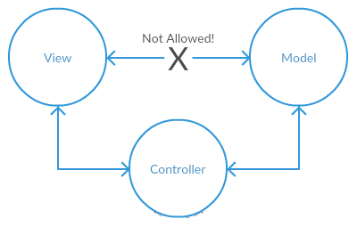
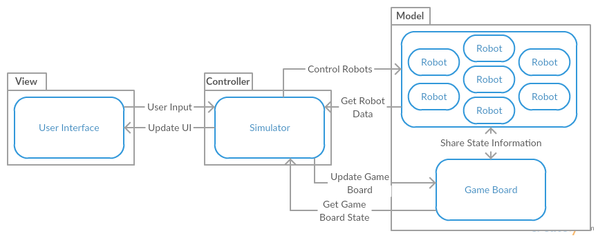

# CMPT 370 Design

Group A3

# Changes to Requirements

We did not have to make any changes to our requirements.

# Preliminary Design
	
## Architecture

We will be utilizing the Model-View-Controller architecture.  Since this architecture splits the project into 3 parts, it will allow us to easily collaborate on code.  Each module will have it's own API, or public interface, allowing someone working on one part of the project to easily interact with another part without worrying about the underlying implementation.  Further, the person working on the one module will be able to make changes without fear of breaking it for the other modules, since they know how the other modules are interacting with it.

\  

\newpage

## Modules

The architecture for this project will be broken into 3 parts, as per the Model-View-Controller architecture:

### 1. Model

The Model contains all the data for the application.  This includes things like the robot objects, and the game board.  The controller uses the data in this module to simulate the game.  The controller will also use the public methods in this module to control the robots and game board.

### 2. View

The View module of the MVC architecture will be responsible for creating the graphical user interface.  It will have public methods to allow the controller to output information to the user.

### 3. Controller

The controller is where all of the game logic will be performed.  This is where the simulator will be implemented.  The controller is the brains of the application, and will be able to retrieve data from the model, and output data to the view.

## Data Flows

\  

\newpage

With the Model-View-Controller architecture, The controller acts as the communication hub for the three modules.  Thus, the only communication paths that are allowed are:

- Models <---> Controller
- Views <---> Controller
- Models <---> Models
- Views <---> Views
- Controller <---> Controller

The controller must communicate with the view to output data to the user, and process user input.  The controller has to talk to the model to control the robots, update the game board, and retrieve information on the robots and board to run the simulation.

# Detailed Design
Estimated man-hours are included with each component.

## Code Interfaces

### Model

|Robot (6hrs)          |
|----------------------|
|-teamNumber: *int*    |
|-robotNumber: *int*   |
|-pointsLeft: *int*    |
|-maxMoves: *int*      |
|-movesLeft: *int*     |
|-power: *int*         |
|-health: *int*        |
|-range: *int*         |
|-hasFired: *bool*     |
|+move(coords): *void* |
|+fire(coords): *void* |
|+scan(coords): *Robot*|
|+getStats(): *Stats*  |

\newpage

|GameBoard (10hrs)                               |
|------------------------------------------------|
|-robots: *Robot* \[ \]                          |
|-cells: *Cell* \[ \]                            |
|-constructor(Team\[ \]): *GameBoard*            |
|+addRobot(file): *void*                         |
|+addTeam(team): *void*                          |
|+setPosition(robot:Robot, coord:Coord): *void*  |
|+setHealth(robot, health:int): *void*           |
|+getCells():*Cell* \[ \]                        |
|+getCell(Coordinate): *Cell*                    |



### Controller

  Match Controller Object (10hrs)
  ------------------------------------
  robots: *Robot* \[ \]
  cells: *Cell* \[ \]
  turnNumber: *int* 
  maxTurns: *int*
  currentTeam: *int*
  executionSpeed: *int*
  stepForward(): *void*
  stepBack(): *void*
  getContentsOfCell(coords): *Robot*
  damageRobot(robot): *void*



### Views

  Main Menu View (4hrs)
  -----------------------------
  +loadWatchMatch(): *void*
  +loadInstantResults(): *void*
  +loadTestBench(): *void*

  Team Select View (4hrs)
  ---------------------------
  -teams: *Team* \[ \]
  +loadTeam(int slot): *void*
  +confirm(): *void*
  confirm(): *void*

  Watch Match View (8hrs)
  ------------------------------
  -controller: *MatchController*
  +step(): *void*
  +play(): *void*
  +stop(): *void*
  +setRate(int rate): *void*
  +updateDisplay(): *void*
  +updateLog(string log): *void*

  Test Bench View (inherits from Watch Match View) (2hrs)
  --------------------------------------------------------
  +runCommand(): *void*

  Match Results View (2hrs)
  --------------------------
  -scores: *score \[ \]*
  +returnToMenu(): *void*
  
\newpage

## ADTs

### Game Controller
#### Sets:
GC: set of Game Controller Objects  
Robot: set of Robots  
Cell: set of Cells  
Coord: set of cell coordinates  
Team: set of robot teams  
int: set of integers (Z)  

#### Signatures:
newGameController(teams) Team[] --> GC  
GC.getCells() --> Cell[][]  
GC.getCell(coord) Coord --> Cell  
GC.stepForward() --> GC  
GC.stepBack() --> GC  
GC.pause() --> GC  
GC.play() --> GC  
GC.setSpeed(speed) int --> GC  
GC.viewStats(robot) Robot --> Stats   
GC.selectRobot(robot) Robot --> GC


#### Semantics:
newGameController(teams):
  Returns a new game controller initialized with the robots in the teams given.

GC.getCells():
  Returns an matrix such that matrix[x][y] contains the cell at coords(x, y)

GC.getCell(coord):
  Returns the cell object located at coord.

GC.stepForward():
  After execution the program counter for the currently executing robot will be 
  increased by one, switching to the next robot if the program completes.
  Execution of the instruction will change robots and cells according to the 
  semantics of the instruction itself, within the limitations of the language.

GC.stepBack():
  Resets the GC to the state before the previous stepForward();

GC.play():
  Begins to stepForward the GC at every *time* interval.

GC.pause():
  Causes GC to hold at the current state until stepBack, stepForward, or play 
  are called.

GC.setSpeed(speed):
  Sets the interval between steps of the GC to some inverse of speed.

GC.viewStats(robot):
  Returns the relavent statistics about the robot for viewing.

GC.selectRobot(robot):
  This function selects a given robot to the be the target of further actions
  such as viewStats.
  
#### UML Class Diagram:

|GameController                                  |
|------------------------------------------------|
|Properties:                                     |
|------------------------------------------------|
|-speed: int                                     |
|-teams: Team\[ \]                               |
|-paused: bool                                   |
|-selected: Robot                                |
|-currentlyExecuting: Robot                      |
|------------------------------------------------|
|Functions:                                      |
|------------------------------------------------|
|+constructor(teams: Team\[ \]): GameController  |
|+getCells(): Cell\[ \]\[ \]                     |
|+getCell(coord: Coordinate) Coord: Cell         |
|+stepForward(): void                            |
|+stepBack(): void                               |
|+pause(): void                                  |
|+play(): void                                   |
|+setSpeed(speed: int): void                     |
|+viewStats(robot: Robot): Stats                 |
|+selectRobot(robot: Robot): void                |

\newpage

### Test-Bench Controller
Test-Bench Controller extends the specifications from the Game Controller ADT.

#### Sets:
TB: set of Test Bench Controllers  
String: Set of strings  
Stat: An object containing statistics pertaining to an individual robot.  

#### Signatures:  
TB.executeCommand(command) String -> TB  

#### Semantics:  
TB.executeCommand(command):  
  This function takes the string "command" (presumably from a user input box) and executes the command against the selected robot, according to the robot  language specification and limitations.  

#### UML Class Diagram:

|TestBenchController (inherits from GameController)  |
|----------------------------------------------------|
|Functions:                                          |
|----------------------------------------------------|
|+executeCommand(command: String): void              |

\newpage

### Robot Object
#### Sets:
CO : Set of all game board coordinates  
R : Set of all Robots  
I : Set of all Integers  

#### Signatures:
newRobot(*i, i, i, i, i, i*) --> R  
*R*.move(*co*)  CO --> R  
*R*.fire(*co*)  CO --> R  
*R*.scan(*co*)  CO --> R  
*R*.getStats() --> S  

#### Semantics:
newRobot(*i, i, i, i, i, i*): Takes the following values as Integers:  

- teamNumber
- maxMoves
- power
- health
- range

And returns a Robot initialized with those values.  You don't need to supply robotNumber because that will be computed by the program.  Also, pointsLeft and movesLeft are default values.

*r*.move(*co*): Moves the robot to the given coordinate on the game board  
*r*.fire(*co*): Fires at the robot at the given coordinate on the game board  
*r*.scan(*co*): If there is a Robot at the given coordinate on the game board, return that Robot.  Otherwise, return nothing.  
*r*.getStats(): Returns a Stats object for the Robot  

\newpage

#### UML Class Diagram:

|Robot                                                                               |
|------------------------------------------------------------------------------------|
|Properties:                                                                         |
|------------------------------------------------------------------------------------|
|-teamNumber: int                                                                    |
|-robotNumber: int                                                                   |
|-pointsLeft: int                                                                    |
|-maxMoves: int                                                                      |
|-movesLeft: int                                                                     |
|-power: int                                                                         |
|-health: int                                                                        |
|-range: int                                                                         |
|-hasFired: bool                                                                     |
|------------------------------------------------------------------------------------|
|Functions:                                                                          |
|------------------------------------------------------------------------------------|
|+constructor(int teamNumber, int maxMoves, int power, int health, int range): Robot |
|+move(coord: Coordinate): void                                                      |
|+fire(coord: Coordinate): void                                                      |
|+scan(coord: Coorginate): void                                                      |
|+getStats(): stats: Statistics                                                      |

\newpage

### Main Menu View :
Main Menu View display the choice between watch mode, Instant result mode, and test bench mode
for user to choose.

#### Sets:
V: set of View such as Main Menu View, load Watch Match, load Instant Results and load Test Bench.

#### Signatures:

V.loadWatchMatch() --> V  
V.loadInstantResults() --> V  
V.loadTestBench() --> V  

#### Semantics:

For all v in set V    

v.loadWatchMatch(): load Watch Match view.  
v.loadInstantResults(): load Instant Results view.  
v.loadTestBench(): load Test Bench view.  

#### Preconditions:

v.loadWatchMatch(): None  
v.loadInstantResults(): None  
v.loadTestBench(): None  

#### UML Class Diagram:

|Main Menu View                |
|------------------------------|
|Functions:                    |
|------------------------------|
|+loadWatchMatch():void        |
|+loadInstantResults():void    |
|+loadTestBench():void         |

\newpage

###Team Select View
#### Sets:
T: set of Robot Teams
R: set of Robots
int: set of integers

#### Signatures:
newTeamSelectView() --> T
T.addRobot(int) R --> T
T.addTeam(int) T --> T
T.confirm()

#### Semantics:
newTeamSelectView():
  Creates a new instance of a TeamSelectView.

loadRobot(int team):
  Lets the user select a Robot file, adds it to the team specified.

loadTeam(int team):
  Lets the user select a Robot Team file, adds it to the team specified.

confirm():
  Confirms the current team selections.

#### Preconditions:
addRobot(): selected Robot File must be a valid Robot File.
addTeam(): selected Robot Team File must direct to valid Robot Files.

#### UML Class Diagram:

|Team Select View              |
|------------------------------|
|Functions:                    |
|------------------------------|
|+constructor() : TeamSelect   |
|+loadRobot(int team) : void   |
|+loadTeam(int team) : void    |
|+confirm() : void             |

\newpage


### Watch View
#### Sets:
WV: set of Watch View Objects  
int: set of integers
S: set of strings

#### Signatures:
newWatchView() --> WV  
WV.step() --> WV  
WV.play() --> WV  
WV.stop() --> WV  
WV.setRate(int) int --> WV  
WV.updateDisplay() --> WV  
WV.updateLog(string) S --> WV  

#### Semantics:
newWatchView():  
  Creates a new instance of WatchView.  
  
WV.step():  
  Steps forward one increment of gameplay.  

WV.play():  
  Plays the game at the current rate.  

WV.stop():  
  Stops the game where it is.  

WV.setRate(int rate):  
  Sets the new rate of gameplay.  
  
WV.updateDisplay():  
  Tells the WatchView to update the game display.  

WV.updateLog(string log):  
  Tells the WatchView to update the log.  

\newpage
  
#### UML Class Diagram:

|WatchView                       |
|--------------------------------|
|Properties:                     |
|--------------------------------|
|-log: String\[ \]               |
|--------------------------------|
|Functions:                      |
|--------------------------------|
|+constructor(): WatchView       |
|+step() : void                  |
|+play() : void                  |
|+stop() : void                  |
|+setRate(int rate) : void       |
|+updateDisplay() : void         |
|+updateLog(string log) : void   |


\newpage


### Test Bench View :
Test Bench View takes the command from the user to modify the state of the game.

#### Sets:
C: set of commands to control/modify the state of the game 

#### Signatures:

runCommand() --> c

#### Semantics:

For all c in set C    

runCommand(): run the command input by the user  

#### Preconditions:

runCommand(): must be a valid command

#### UML Class Diagram:

|Test Bench View               |
|------------------------------|
|Functions:                    |
|------------------------------|
|+runCommand():void            |

\newpage


### Game Board
#### Sets:
GB: set of Game Board Objects  
Robot: set of Robots  
File: set of Robot Files  
Cell: set of Cells  
Coord: set of cell coordinates  
Team: set of robot teams  
int: set of integers (Z)  

#### Signatures:
newGameBoard(teams) --> GB  
GB.addRobot(file) --> GB  
GB.addTeam(team) --> GB  
GB.setPosition(robot, coord) --> GB  
GB.setHealth(robot, int) --> GB  
GB.getCells() --> Cell[][]  
GB.getCell(coord) Coord --> Cell  

#### Semantics:
newGameBoard(teams):
  Initializes a new GameBoard with the selected teams loaded
  
GB.addRobot(file):
  Adds a robot to the set of loaded robots by reading in a file.
  
GB.addTeam(team):
  Adds all robots specified in a team file.
  
GB.setPosition(robot, coord):
  Updates the position of a robot to the given coordinate.
  
GB.setHealth(robot, int):
  Updates the health of a robot to the given level.

GB.getCells():
  Returns an matrix such that matrix[x][y] contains the cell at coords(x, y)

GB.getCell(coord):
  Returns the cell object located at coord.
  
\newpage
  
#### UML Class Diagram:

|GameBoard                                  |
|-------------------------------------------|
|Properties:                                |
|-------------------------------------------|
|-cells: Cell\[ \]\[ \]                     |
|-robots: Robot\[ \]                        |
|-------------------------------------------|
|Functions:                                 |
|-------------------------------------------|
|+constructor(teams: Team\[ \]): GameBoard  |
|+addRobot(file) : void                     |
|+addTeam(team) : void                      |
|+setPosition(robot, coord) : void          |
|+setHealth(robot, int) : void              |
|+getCells(): Cell\[ \]\[ \]                |
|+getCell(coord: Coordinate) Coord: Cell    |

\newpage

### Match Results View :
Match Results View displays the team scores of robots.

#### Sets:
score: set of all robot team scores
V: set of View such as Main Menu View, load Watch Match, load Instant Results
and load Test Bench.

#### Signatures:

V.returnToMenu()

#### Semantics:

For all v in set V    

v.returnToMenu(): returns the view to Main Menu View

#### Preconditions:

v.returnToMenu(): None  

#### UML Class Diagram:

|Match Results View            |
|------------------------------|
|Properties:                   |
|------------------------------|
|-score: scores\[ \]           |
|------------------------------|
|Functions:                    |
|------------------------------|
|+returnToMenu():void          |
