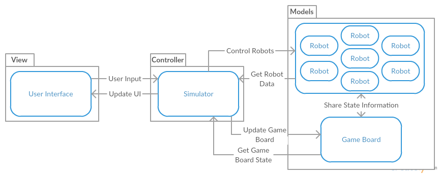

# Design

## Preliminary Design

Need:

- ~~Data Flows~~
- ~~Large modules/packages~~
- ~~Architectural Design~~
	- ~~The modules, and~~
	- ~~Their interactions~~
	
### Architecture

We will be utilizing the Model-View-Controller architecture.  Since this architecture splits the project into 3 parts, it will allow us to easily collaborate on code.  Each module will have it's own API, or public interface, allowing someone working on one part of the project to easily interact with another part without worrying about the underlying implementation.  Further, the person working on the one module will be able to make changes without fear of breaking it for the other modules, since they know how the other modules are interacting with it.

\  

### Modules

The architecture for this project will be broken into 3 parts, as per the Model-View-Controller architecture:

#### 1. Model

The Model contains all the data for the application.  This includes things like the robot objects, and the game board.  The controller uses the data in this module to simulate the game.  The controller will also use the public methods in this module to control the robots and game board.

#### 2. View

The View module of the MVC architecture will be responsible for creating the graphical user interface.  It will have public methods to allow the controller to output information to the user.

#### 3. Controller

The controller is where all of the game logic will be performed.  This is where the simulator will be implemented.  The controller is the brains of the application, and will be able to retrieve data from the model, and output data to the view.

### Data Flows

\  

With the Model-View-Controller architecture, The controller acts as the communication hub for the three modules.  Thus, the only communication paths that are allowed are:

- Model <---> Controller
- View <---> Controller
- Model <---> Model
- View <---> View
- Controller <---> Controller 

The controller must communicate with the view to output data to the user, and process user input.  The controller has to talk to the model to control the robots, update the game board, and retrieve information on the robots and board to run the simulation.

## Detailed Design

Need:

- Data Formats/Table Layouts
- Code interfaces (i.e. public class interfaces)
	- Method names
	- Post-, pre-, and error conditions
- Optional pseudocode for complex operations 

### Code Interfaces

#### Model

|Robot Object         |
|---------------------|
|*int* teamNumber     |
|*int* robotNumber    |
|*int* pointsLeft     |
|*int* maxMoves       |
|*int* movesLeft      |
|*int* power          |
|*int* health         |
|*int* range          |
|*bool* hasFired      |
|*void*: move(coords) |
|*void*: fire(coords) |
|*Robot*: scan(coords)|
|*Stats*: getStats()  |

#### Controller

|Match Controller Object            |
|-----------------------------------|
|*Robot* [ ] robots                 |
|*Cell* [ ] cells                   |
|*int* turnNumber                   |
|*int* maxTurns                     |
|*int* currentTeam                  |
|*int* executionSpeed               |
|*void*: stepForward()              |
|*void*: stepBack()                 |
|*Robot*: getContentsOfCell(coords) |
|*void*: damageRobot(robot)         |

#### Views

|Main Menu View                     |
|-----------------------------------|
|*void* loadWatchMatch()            |
|*void* loadInstantResults()        |
|*void* loadTestBench()             |


|Team Select View                   |
|-----------------------------------|
|*Team* [ ] teams                   |
|*void* loadTeam(int slot)          |
|*void* confirm()                   |

|Watch Match View                   |
|-----------------------------------|
|*MatchController* controller       |
|*void* step()                      |
|*void* play()                      |
|*void* stop()                      |
|*void* setRate(int rate)           |
|*void* updateLog(string log)       |
|*void* (string log)                |

|Test Bench View (inherits from Watch Match View)|
|------------------------------------------------|
|*void* runCommand()                             |

|Match Results View                 |
|-----------------------------------|
|*score [ ]* scores                 |
|*void* returnToMenu                |
