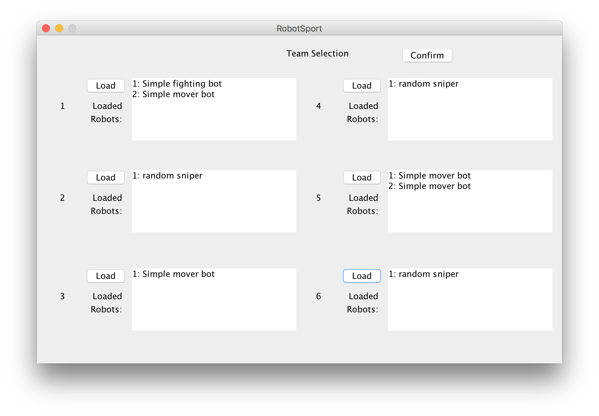
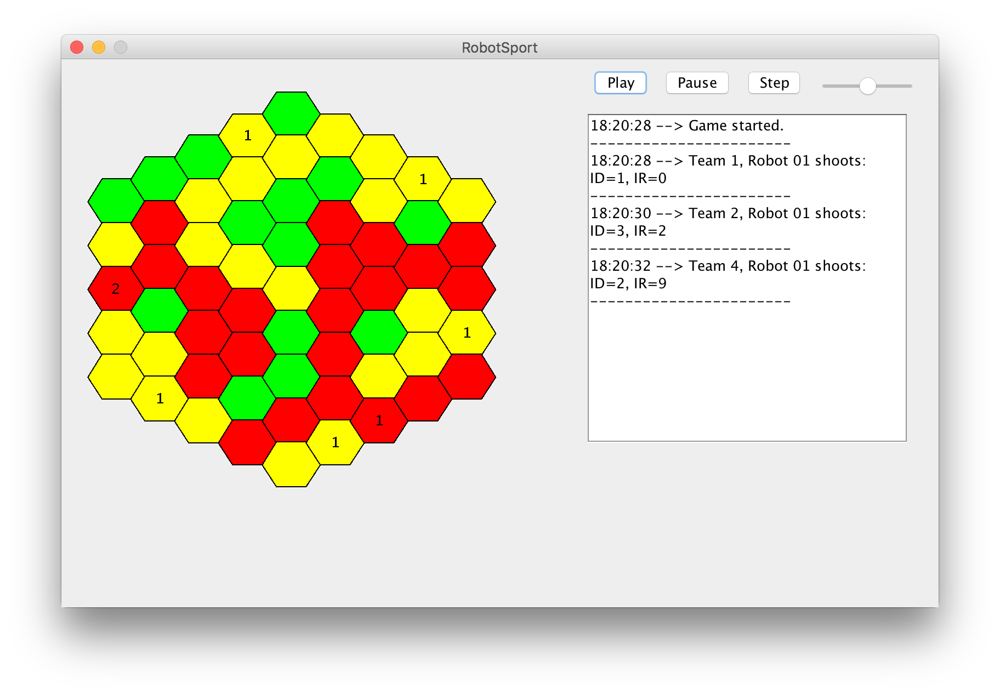

-------------------------------------------------------------

Implementation Git release tag: ( TAG GOES HERE )

Group A3 Members:

- Chin Wang Lau
- Chris Penner
- Evan Salter
- Erik Schick
- Vishal Tomar

## Implementation challenges

Implementing RoboSport is the largest project many of the team members have 
been involved with, and so it certainly brought along many challenges. The 
first challenge we came across was one of communication. Since all group 
members are students involved in a large number of other commitments, it was 
difficult for us to communicate well and get ourselves on the same page during 
this project. These communication problems manifested themselves in our 
implementation in several ways. Facing the reality that there were few times 
when we could all work together, we decided to divide the project as much as we 
could into distinct modules which could be linked together. This had the 
advantage that we could each work on our own designated module, and also meant 
that we could utilize unit testing more effectively in most cases. 

We ran into some implementation issues in regards to the JSON library we've 
decided to use, (see more about the Gson library below). The biggest issue 
pertained to deserializing the 'code' portion of a robot because it is an array 
containing objects which correspond to different Java classes depending on the 
contents of the object, that is a 'variable' entry is different semantically 
from a 'word' entry. Luckily, after reading some library documentation we were 
able to write a custom deserializer which overcame these issues.

As we continued to work on the project, not only did some of the requirement 
specifications change (for instance having ground of different terrain 
difficulty) but also our understanding of different elements of the project 
evolved as we got further into our implementation. We had a very weak 
understanding of how much of the robot language worked when we started and have 
needed to adjust our expectations and implementation to fit our new 
understanding as we continue onwards. An example of this are the identify! and 
scan! keywords. These are meant to help identify nearby robots, however we 
realized that the notion of 'direction' is difficult on a hex grid. A robot may 
be in 'range' but still isn't addressable using our direction system. To solve 
this problem we decided that 'visible' means that a square must be some range 
in one of the 6 directions, and we adjusted our implementation of scan! and 
identify! to reflect this.

## State of implementation

Unfortunately, due to time pressures, the complexity of the project, and 
unbalanced group dynamics we have not succeeded in implementing a version of 
RoboSport which fulfills our requirements. In accordance with Hofstadter's law, 
things took longer than expected and complexity arose along the way. Though we 
wish we could have succeeded in implementing more of the features, we learned a 
lot about how projects grow, and how interaction between multi-level systems 
with many parts can become complex quickly.

In the end, our version of RoboSport can successfully import several teams of 
robots from JSON robot files and can construct Robot models with the 
appropriate statistics. It can then allow them to fight in an arena, providing 
the user with a user interface that allows pausing, playing, and changing the 
speed of the fight. The game board shows the position of robots on the board 
and the number of robots on each square. We also created an "instant match" 
mode in which the game is played in the background, and the results are displayed
to the user once the winner has been determined. Finally, we have a test-bench
mode.  In this mode, the user is able to import robots and execute commands to
test the functionality of both the robot and the game.

We were able to assign different movement difficulties to each cell, though
the robots currently do not pay attention to these difficulties.  We simply
ran out of time to fully implement it.  However, the difficulties are dispalyed
on the game board through the use of green, yellow, and red colourings on the 
hex tiles. We were also not able to implement the robot 
librarian software, though this was due to the fact that it was not available 
for testing and was not made available to groups within reasonable time. Our 
display leaves much to be desired and doesn't clearly display stats about 
robots involved with the fight, and we would have added a lot of styling 
changes to the project if we had more time available.

## Design deficiencies

Since we chose the MVC architecture we also came across some times where our 
design decisions made it tough to avoid crossing View->Controller boundaries.
In some cases we had to sacrifice the purity of this abstraction because of 
time constraints, but we've learned more about how we could have designed the 
system to avoid the need to break our boundaries.

Overall we have discovered that our design document was lacking a few classes 
and methods which we have added to the final project. In most areas we were 
sufficiently accurate in our designs, however there were a few areas of 
oversight; for example the parsing and interpreting of robot language code was 
not given the necessary level of attention. As a result we have needed to add a 
Parser class which attaches to a Robot in order to interpret its robot language 
program.

While we had a basic understanding of how the MVC architecture would be 
implemented, a few of the more specific implementation details were forgotten 
in our design. Specifically the notion of how the view should be updated. We 
must choose between several options, such as updating it explicitly from the 
controller, using a thread to update the view based on underlying data every 
few seconds, or to use some form of event based triggering system. In the end 
we decided that for a project of this scope it is easiest to use an 'update' 
method on the view which we can call whenever the underlying data changes.

Due to time constraints and less-than-optimal planning, we often relied too heavily on 
public static variables rather than passing the object references to each module
in our MVC architecture.  Given more time, we would have cleaned up that code
to ensure only specified modules have access to certain objects.

## Pair programming and Code Reviews

An inevitable challenge when working with others is that of programming 
preferences and coding styles. Since the project is relatively small and there 
were few of us involved we have not been strict in enforcing a particular code 
formatting style, however since we have all been using the 'eclipse' IDE, and 
we all have similar backgrounds in Java programming (from our previous classes) 
we have found that our code style has been relatively consistent across the 
group. In Java there are several cases where there is more than one way to 
accomplish the same task (e.g. 'for' loops vs iterators vs 'for each' loops, 
etc.) In the cases where we have discovered inconsistencies we have done our 
best to rectify them.

As stated earlier, communication has been a challenge for us, one way that we 
were able to help with spreading our knowledge amongst the group was to pair 
program when possible, this was particularly useful whenever we were in the 
process of linking together modules we had written separately, as it allowed us 
to make sure we were connecting them appropriately and verify that they worked. 
When pair programming wasn't possible due to scheduling conflicts, we could
resort to asking questions in our team's group chat.  

Since we have done the majority of our work on a single master branch, we have 
not been able to do code review on individual 'pull requests' as we would have 
liked to do, we were able to use 'git diff' to some degree of success. As our 
project neared completion we looked over each other's modules and pointed out 
areas where code could be improved, doing what we could to clean it up. At this 
point we realize that our overall code quality would be much improved if we had 
been using more pair programming and code review as we built the project.

## Division of Labour

As stated above, our team decided primarily use a divide and conquer based 
approach to implementing our system. Each module involved in the system had one 
team member who was responsible for that module. That team member would 
implement that module and provide an interface for each of the other modules to 
use and we would pair program to link the modules together in a sensible way. 
The modules we decided on were as follows:

* Views and GUI - Erik
* Controller and game logic - Evan
* Forth Parser and Robot importer - Chris

## Use of External Libraries

The vast majority of the project was implemented using the standard tools 
available as part of Java, however we decided to use an external library for 
the purpose of parsing incoming JSON robot files. The library we chose for this 
is Google's library called 'Gson'. Gson vastly simplifies the task of 
deserializing robot files into the Java classes we need. We have used it by 
defining a Robot model which matches the JSON Robot Schema we were provided 
with as closely as possible. We have written in a 'fromJson' static method into 
our Robot class as an alternative way to construct a Robot. This function wraps 
Gson's 'fromJson' method and utilizes a custom deserializer for the 'code' key 
within a Robot JSON file, then uses the resulting objects to initialize the 
robot object with the correct health, firepower, variables, words, etc. We 
found this library relatively easy to work with, though it does have 
complications when working with arrays containing multiple types of data. We 
would definitely utilize this library again in future projects and had a good 
experience with it.

We have used the JUnit testing library to iteratively test and in some cases 
TDD our implementation. This has been invaluable in preventing regressions in 
our code as we continue to build. It has also helped us to iterate quickly 
because after significant code changes we can simply run the tests for a given 
module and ensure that it is still behaving as we expect. JUnit has proven to 
be useful as a debugging tool as well, when there is a behaviour that is 
unexpected we can simply use the debugger in Eclipse to walk through the 
failing JUnit test and discover the error. TDD and JUnit was not used in 
implementing the Views because they are largely aesthetic in nature, the 
Controller is also untested because it glues many pieces of the code together 
and would require extensive mocking and stubbing to unit test. We've learned 
that designing our code in a way that is easy to test is important for future 
projects. The Robot model and the parser/interpreter implementations were 
developed largely using JUnit with TDD. Not everyone in the group wanted to use 
TDD, and so some portions of code remain untested. 

## Documentation

Since this application is meant to be used via a GUI by users there was not 
much in the way of API documentation, and the general use cases are covered in 
detail in our User Guide. For internal use many of our functions have javadocs 
associated with them to clarify how functions are to be used. 

Please read the User Guide for more details on how to use the software.

## Final Implementation Statistics

- Total Lines of code: 3285
- Total # of classes: 22
- Total # of methods: 178

One member of the group decided to use TDD to develop his part of the 
application (Chris) and so both the Parser class and Robot class have a small 
suite of unit tests written using JUnit. These are not as comprehensive as we 
would have liked, but we definitely saw the value in having a way to notice 
regressions as soon as possible. The TDD method was invaluable when working 
with complex systems like the forth interpreter.

## Screenshots

The following is our Main menu where the user can select which sort of game 
mode they'd like to try.

\  

The following is where a user can load Robots onto teams via json files.

\  

The following is a view of a gameboard in action where Robots are fighting.

\  

The following is the results screen, which shows the winner of the match after completion.

\  

The following is the test-bench screen, which allows the user to execute commands on a robot to test the gameplay.

\  

##How to compile

Since we have developed this project using the Eclipse IDE we recommend using 
Eclipse to build and manage the project. Firstly you must import the project by 
clicking 'File > import' and choosing 'existing projects into workspace'. 
Follow the dialog to import this project into your workspace.
Next it is important to make sure that the external libraries which we used are 
present on your build path. This can be accomplished within Eclipse by looking 
inside the 'lib' folder in the project explorer and choosing 'add to build 
path' for both of the JUnit and Gson jars there. From this point it should be 
sufficient to locate the 'Main.java' file in the 'main' package in the package 
explorer, right click it and choose 'Run As > Java Application'.

## Robot tests

You can find several of our testing robots in the src/misc directory of the 
java project. We've used different types of robots for testing different 
portions of development. For instance there is a "simplemover.json" robot which 
just moves itself in small circles, this was useful for testing movement and 
giving a target for shooting robots. One other robot we used is the 
"basicfighter.json" which scans for robots and if it finds one will attempt to 
chase and shoot it. This one has logic which uses 'if' and 'loop' statements 
and is a good candidate for testing our parser and also the shooting/scanning 
functions.
