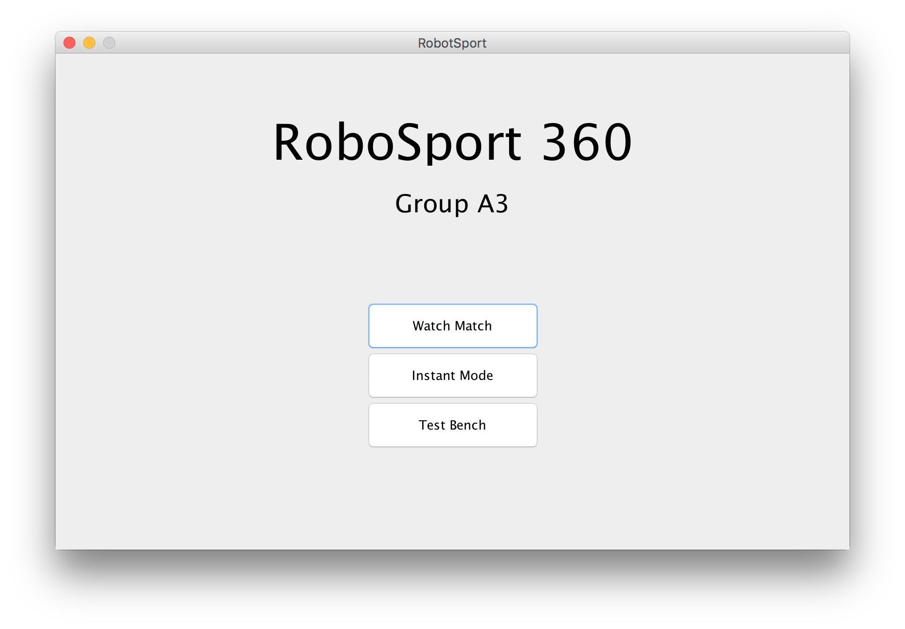

-------------------------------------------------------------

## Getting started

(This guide assumes an executable jar has been distributed to the user)

Please start the provided software and you will see the following screen:

## Main Menu

\  

This menu presents you with 3 options. Presently only the "Watch Match" option 
is functional. The other 2 options will be implemented in future releases of 
the software.

To watch a RoboSport match, please select the "Watch Match" option by clicking 
the appropriate button.

## Loading Teams

\  

After choosing "Watch Match" from the Main Menu you will arrive at a screen 
which allows you to load robots onto teams to participate in a match. For each 
of the 6 teams you see a "Load" button. Clicking this button for a team allows 
you to select a JSON encoded robot specification. 

It is possible to start a robot match with any number of robots up to a maximum 
of 4 per team. Notice the robots' names displayed in the text area as you 
import the robots.

Once you are satisfied with the robots on each team select the "confirm" option 
in the top-right corner.

## Viewing a Match

\  

On the Game board screen you'll notice two clear portions; the display area on 
the left and the control area on the right. In the display area you can see the 
positions of the robots on the board and watch them as they move around. In the 
control area you can find transport controls to alter the speed at which the 
match plays. To start the match, press the "start" button. At this point you 
can use the scrubber to change the speed that moves take place. You may use the 
"Stop" button to pause the match, then use "Play" to resume. The "Step" button 
will progress the match one robot's turn at a time.

