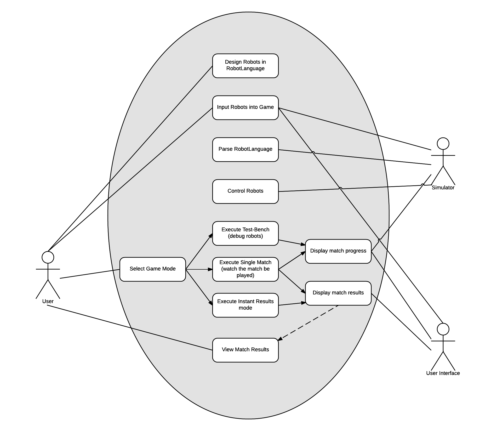
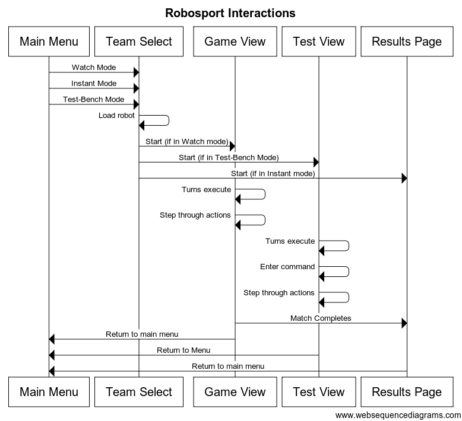
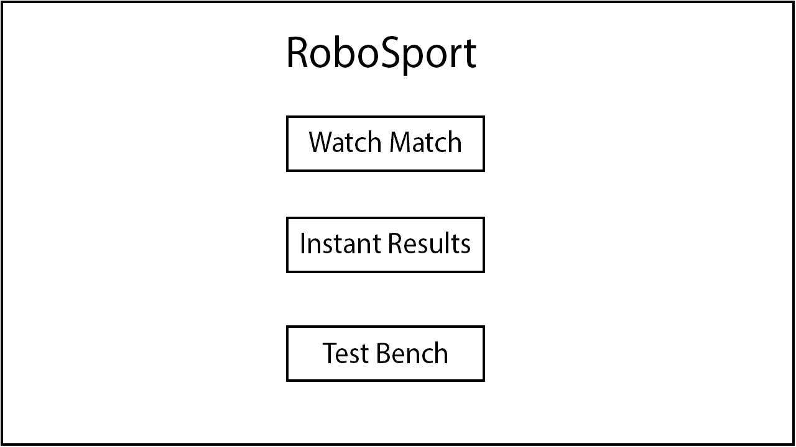
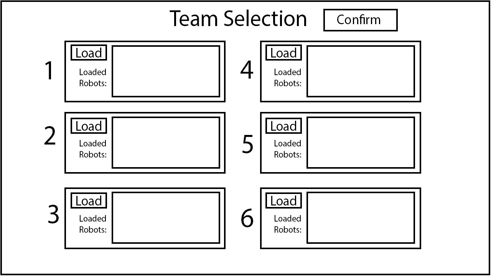
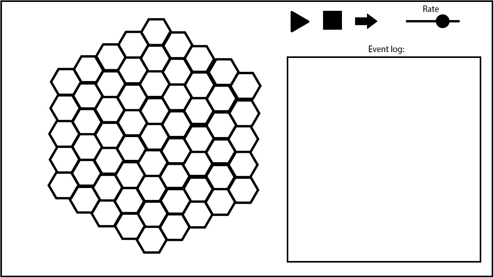
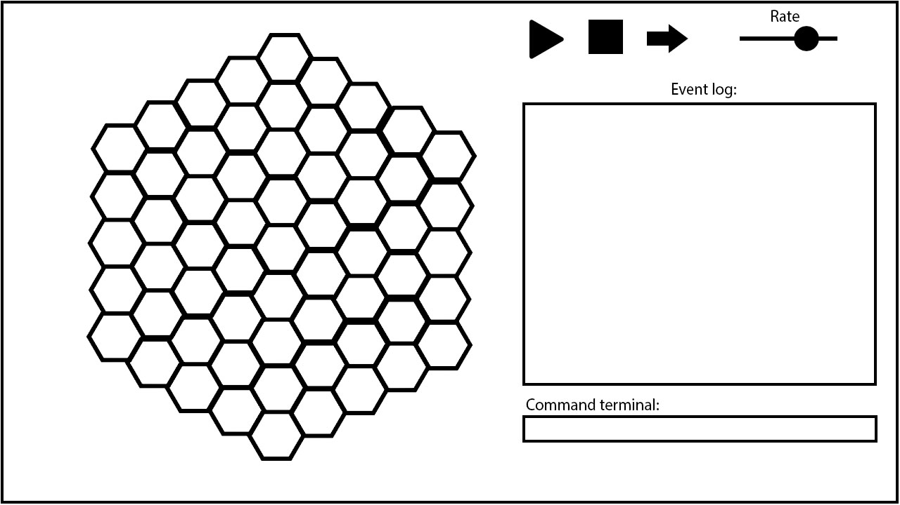
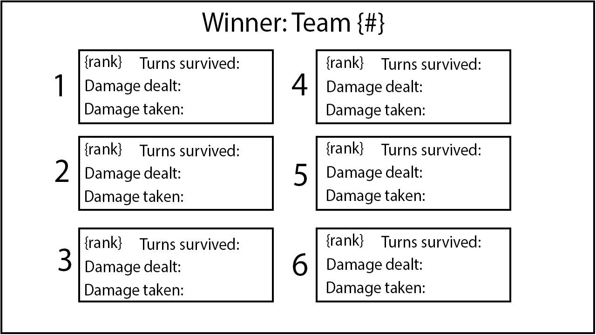

# Requirements Document
CMPT 370  
Group A3  

## Platform
Robosport must have the capability to run on the Java Virtual Machine, and therefore will run 
on any platform that has the capability to run the Java Virtual Machine. Developer will run test on different operation system such as,Linux and window. Also, developer will test the program  on tuxworld.

## Scope
### Must have
The program must have the ability to import robots via plain-text files containing programs written using the robot language as defined in the RobotSport370 Language specification. During a Robosport match each robot must behave according to their program and must follow the commands defined in their program as defined in the specification with the limitation that the robot must not violate the [rules of a RoboSport Match](#robosport-rules).

There must exist a user interface for the program such that a user may select "RoboSport370 language" program files for
the robots participating in any given match. This interface must also allow the user to define a match to take place,
choosing among the various match types available as are specified below, including at minimum [Watch Match](#watch-match).
and [Instant Results](#instant-results).

There will different mode for user to choice.
In instant mode, user will have the game result and the information on the combat after team select. 
In watch mode, user can control the robot's move and attack to versus AI or other user. 

There will have simple AI and control on robots.

### Should have
The program should if possible contain the [Test-Bench](#test-bench) mode specified below.
There should have play and stop button when play tournament. This help user have better control when they watch the tournament.

### Could have
Program could have sound system, which for different weapon when they do damange. Also there could have background music to make the game is more intersting.

### Would Like to have
If development time permits, it would be desirable to have the ability to import entire robot 'teams' as a single file.
Higher quality graphics are also dependent on time available, as is the depth of the robolanguage debugger optionally 
provided as part of the [Test-Bench](#test-bench).
There may have a online version which allow user use different computer control different team in a tournament.
Have AI that calculate the move for other team and find out the best movement, base on decision diagram. from range health and weapon find out the best way to make damage to other robot in 10 step.

### Limit of Robots
Every Robot should have following data, weapon, health, movesLeft, fire power, fire range, team and member(name).

Health-(int i = 3) If health go 0 the robot will be deleted from the board, otherwise the robot can keep do movement or attack.

Weapon-(String) There is different weapon for every robot choice. Different weapon have different fire power and fire range.
	-Fire Power(int 1 to 3) depend on the weapon
	-Fire Range(int 1 to 3) depend on the weapon
	
Team(int 0-3) Team is for robot to recognize team mate to avoid team attack for user and AI.

Member(int 0-3)To recognize the member inside a team

MovesLeft(int 0-3) If robot move from one node to another. Moveleft will decrease one. Since the node inside the board is cycle, therefore developer will use Dijkstra Algorithm to help robot to move from one node to another(avoid robot move in cycle).

## Times

There is time limit for every tournament. Every game will have 5 minuntes. After that, program will base on the number of robots leave in team. To chose the winning team.
If there is same number of robot leave in more than one team, program will count the total health of robot to determine the winning team.

## Use Case Diagram

\  

## Scenarios
Format Example:
Action
- Preconditions:
- Flow of Events
    - basic path
    - alternate paths
- Postconditions:
- Errorconditions:
---

- When the user selects tournament mode from the main screen, an interface to select and configure robot teams will appear.
- When the user confirms their robot team in tournament mode they will be presented with an option to choose interactive 
  or instant mode.
    - When the user chooses interactive mode a screen will appear showing the robot match interface.
    - When the user chooses instant mode a screen will appear presenting the results.

- When the user selects versus mode from the main screen, an interface to select and configure individual robots will appear.
- When the user confirms their robot team in versus mode they will be presented with an option to choose interactive 
  or instant mode.
    - When the user chooses interactive mode a screen will appear showing the robot match interface.
    - When the user chooses instant mode a screen will appear presenting the results.

- When the user selects test-bench mode from the main screen, an interface to select and configure individual robots will appear.
- When the user confirms their robot team in test-bench mode a screen displaying the robot match debugger interface will appear.

Robots must be able to participate and run in tournaments and perform according to rules and limitations. 

## Interfaces
### Main Interface
The main interface contains the options to select from the available modes as specified in [Modes](#modes).

## Sequence Diagram
\  

## Storyboards
Main window:

\  

Team selection window:

\  

Game screen:

\  

Debug screen:

\  

Results screen:

\  

## Robosport-Rules

## Modes
#### Watch Match
This mode will allow the user to select 2 or more robots to fight one another and must allow the user to select
program files from which to load each of these robots. The user can either watch the match or step through the 
match one action at a time and observe the results. After the match, it will provide a print out of relevant statistics from the match, including at minimum the winner of the match.

#### Instant Results
This mode will allow the user to select 2 or more robots to fight one another and must allow the user to select
program files from which to load each of these robots. The match will be simulated in full without any visual output to the user. After the match, it will provide a print out of relevant statistics from the match, including at minimum the winner of the match.

#### Test-Bench
Test-Bench mode contains the capability for the user to define 1 or more robots by text-files, and may potentially have 
the ability to define a robot-language program as part of the user interface. It must then allow the user to step through 
the program and observe the results. As the match progresses the user must be able to view the statistics of the robots 
involved (e.g. their health, defense, etc.). The Test-Bench mode may provide the option to place obstacles, robots, or generally
alter the setup of the robot arena to better assist the testing of robots.

------

# NOTE

To add diagrams to the document:

1. Save it as an image  
2. Place it in the /doc/reqts/images folder  
3. Place `` in the area of the document you want it to appear.  "Alt-text" should be descriptive of what the image is (i.e. "Use-case diagram")

Tips:

* To do a paragraph break, hit 'enter' twice  
* To do a line break, add 2 spaces to the end of the current line, and hit enter
* Eclipse "Preview" mode for markdown seems to have trouble with nested bullets, but if you format it like I have in "Scope", it should work when we create the final document
* Once you get the hang of Markdown, it's pretty simple.  But if you have any questions, Google is your friend.  Also feel free to ask me (Evan) or Chris.
* Do this short tutorial to get the basics of Markdown: http://markdowntutorial.com