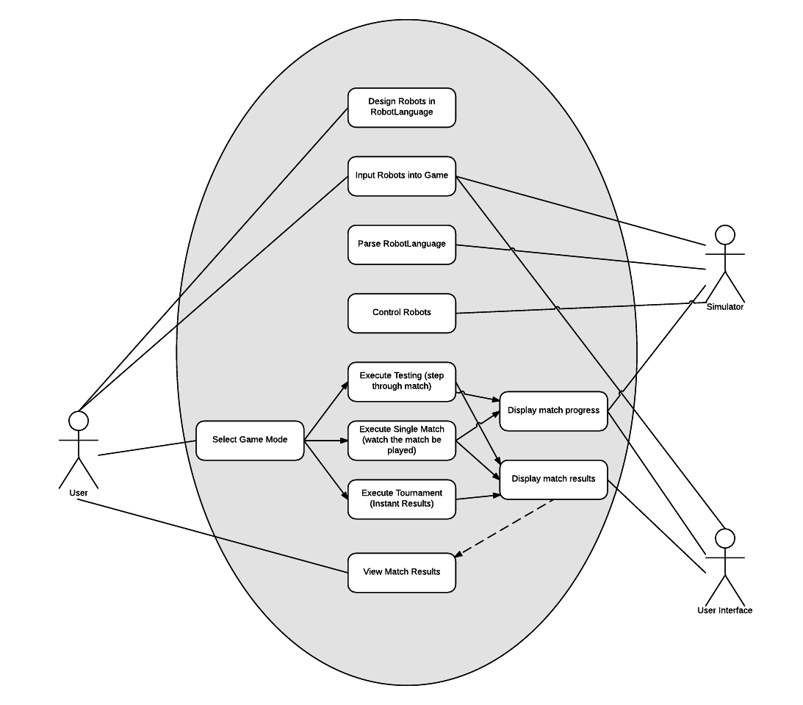
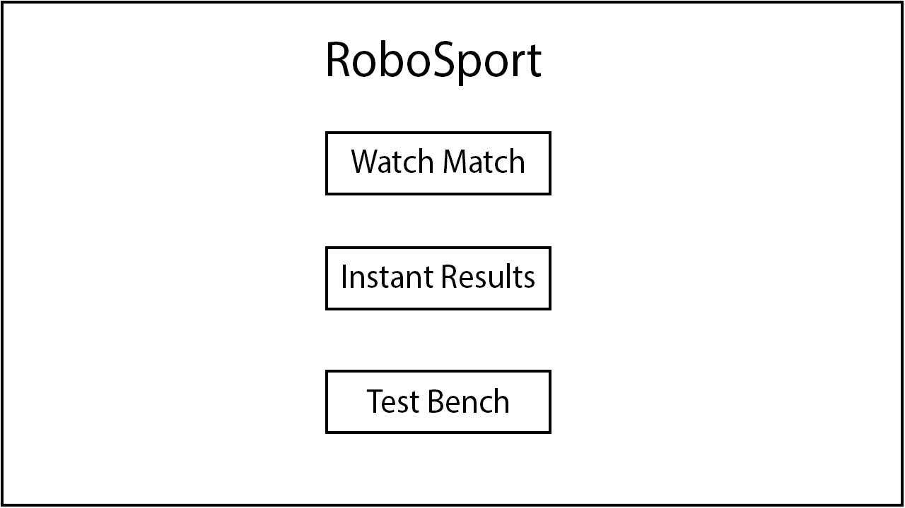
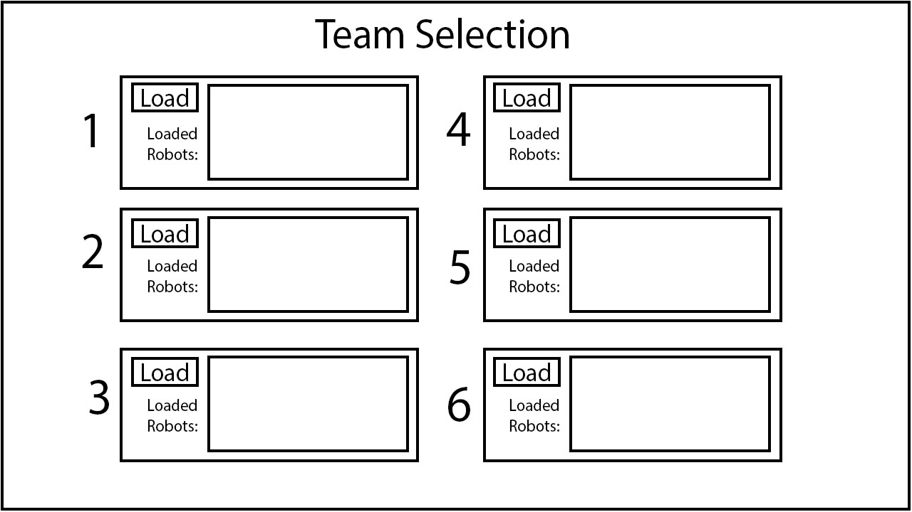
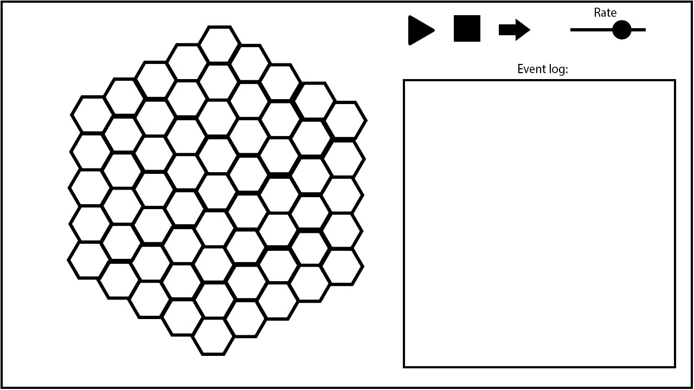
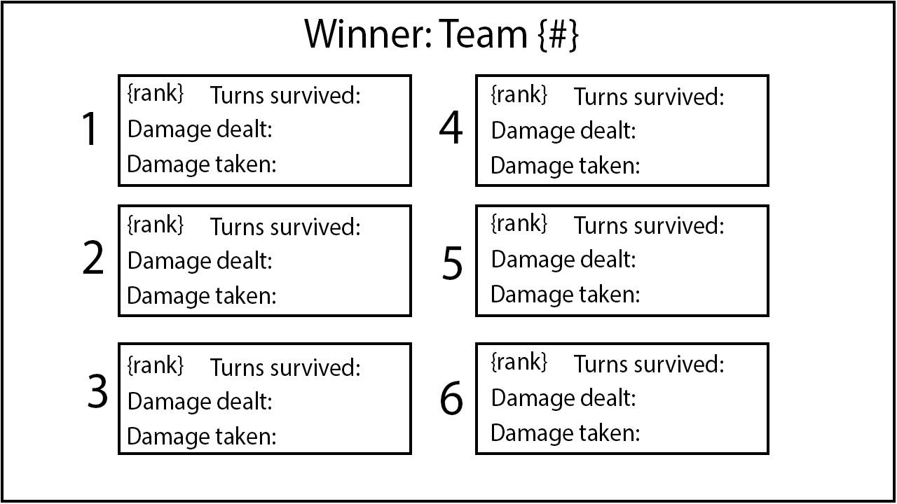

# Requirements Document
CMPT 370  
Group A3  

## Platform
Robosport must have the capability to run on the Java Virtual Machine, and therefore will run 
on any platform that has the capability to run the Java Virtual Machine.

## Scope
### Must have
The program must have the ability to import robots via plain-text files containing programs written using the robot language as defined in the [RobotSport370 Language](RoboSport370-Language.pdf) specification. During a Robosport match each robot must behave according to their program and must follow the commands defined in their program as defined in the specification with the limitation that the robot must not violate the [rules of a RoboSport Match](#robosport-rules).

There must exist a user interface for the program such that a user may select "RoboSport370 language" program files for
the robots participating in any given match. This interface must also allow the user to define a match to take place,
choosing among the various match types available as are specified below, including at minimum [Versus-Match](#versus-match)
and [Tournament-Match](#tournament-match).

### Should have
The program should if possible contain the [Test-Bench](#test-bench) mode specified below.

### Would Like to have
If development time permits, it would be desirable to have the ability to import entire robot 'teams' as a single file.
Higher quality graphics are also dependent on time available, as is the depth of the robolanguage debugger optionally 
provided as part of the [Test-Bench](#test-bench) 

#### Versus-Match
This type of match must allow the user to select 2 or more robots to fight one another and must allow the user to select
program files for each of these robots. It contains an *interactive mode* option where the user can step through the 
match one action at a time and observe the results. It also provides a print out of relevant statistics from the match, 
including at minimum the winner of the match. If interactive mode is not selected, then the results of the match should 
be calculated and presented instantaneously and presented to the user.

#### Tournament-Match
This type of match must allow the user to select between (inclusive) 2 to 6 teams of robots to fight one another and must 
allow the user to select a program file for each robot, it may also allow the user to select a robot team specification 
for each team. This mode also contains an *interactive mode* of the same form as [Versus-Match](#versus-match).
If interactive mode is not selected, then the results of the match should 
be calculated and presented instantaneously and presented to the user.

#### Test-Bench
Test-Bench mode contains the capability for the user to define 1 or more robots by text-files, and may potentially have 
the ability to define a robot-language program as part of the user interface. It must then allow the user to step through 
the program and observe the results. As the match progresses the user must be able to view the statistics of the robots 
involved (e.g. their health, defense, etc.). The Test-Bench mode may provide the option to place obstacles, robots, or generally
alter the setup of the robot arena to better assist the testing of robots.

## Use Case Diagram  

## Scenarios
Robots must be able to participate and run in tournaments and perform according to rules and limitations. 

## Interfaces

## Sequence Diagram

## Storyboards
Main window:

Team selection window:

Game screen:

Results screen:

## Robosport-Rules

------

# NOTE

To add diagrams to the document:

1. Save it as an image  
2. Place it in the /doc/reqts folder  
3. Place `` in the area of the document you want it to appear.  "Alt-text" should be descriptive of what the image is (i.e. "Use-case diagram")

Tips:

* To do a paragraph break, hit 'enter' twice  
* To do a line break, add 2 spaces to the end of the current line, and hit enter
* Eclipse "Preview" mode for markdown seems to have trouble with nested bullets, but if you format it like I have in "Scope", it should work when we create the final document
* Once you get the hang of Markdown, it's pretty simple.  But if you have any questions, Google is your friend.  Also feel free to ask me (Evan) or Chris.
* Do this short tutorial to get the basics of Markdown: http://markdowntutorial.com
